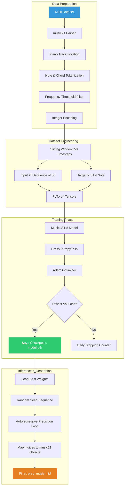
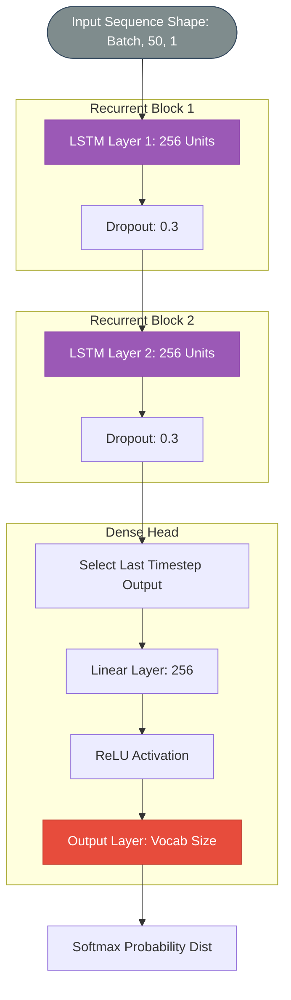

# 📊 System & Model Flowcharts

This document details the architectural pipelines for the Automatic Music Generation project using Mermaid diagrams.

---

## 1. Overall System Architecture
The high-level pipeline from raw MIDI data to AI-generated musical compositions.

---

## 2. MusicLSTM Neural Network Architecture
The internal layer structure of the deep learning model defined in `auto_music_gen.py`.

---

## 🎵 Model Summary Table

| Layer Type | Configuration | Purpose |
| :--- | :--- | :--- |
| **LSTM 1** | 256 Units, Batch First | Captures low-level temporal features. |
| **Dropout** | 0.3 Probability | Prevents overfitting to training sequences. |
| **LSTM 2** | 256 Units, Batch First | Learns complex musical dependencies. |
| **Linear 1** | 256 Nodes | Compresses temporal features. |
| **Activation** | ReLU | Introduces non-linearity. |
| **Linear 2** | Vocab Size | Maps features to note/chord probabilities. |
